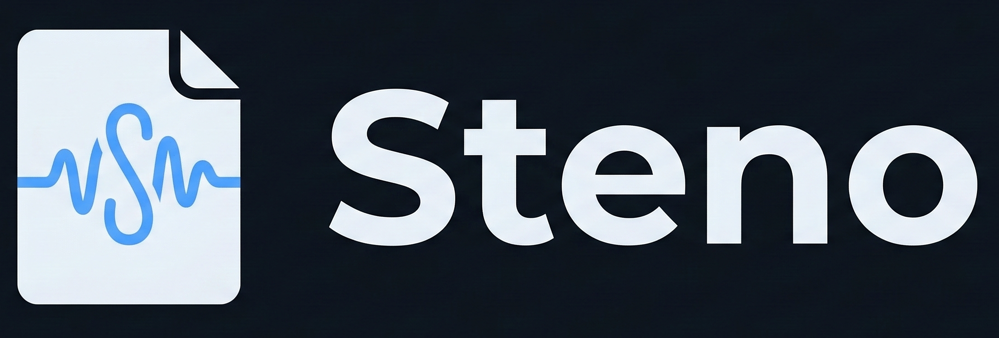

<p align="center">
  
</p>

<p align="center">
  
  
  
  
  
</p>

<h1 align="center">Steno</h1>

<p align="center">
  <strong>Real-time local transcription for classes and meetings.</strong><br>
  Runs 100% on your Mac — no cloud, no data leaves your machine.<br>
  Powered by Whisper via MLX for fast, private, Apple Silicon-native transcription.
</p>

<p align="center">
  <em>Transcripcion local en tiempo real para clases y juntas.</em><br>
  <em>Corre 100% en tu Mac — sin nube, ningun dato sale de tu maquina.</em>
</p>

---

## Features

- **Real-time transcription** — Live audio-to-text with a word-by-word typing animation, powered by [MLX-Whisper](https://github.com/ml-explore/mlx-examples) running natively on Apple Silicon
- **Multiple Whisper models** — Choose from 5 model sizes (tiny to large-v3). Download several and switch at runtime — use a lightweight model in quiet rooms, the full model in noisy classrooms
- **First-launch setup** — Detects your hardware (chip + RAM) and recommends the best model. Downloads it before you start so there are no delays
- **Audio file transcription** — Upload pre-recorded lectures or meetings (WAV, MP3, M4A, OGG, FLAC, WebM, MP4) to transcribe them
- **Markdown notes** — Take rich notes alongside the live transcript with a built-in editor
- **Image support** — Drag & drop whiteboard photos, screenshots, or diagrams directly into your notes
- **Session management** — Save, browse, and export sessions as clean `.md` files
- **Multilingual UI** — English and Spanish with auto-detection, switchable at runtime
- **Desktop app (Electron)** — One-click install for non-technical users. No terminal, no Python setup
- **100% offline** — Everything runs locally. No accounts, no telemetry, no data ever leaves your machine

## Installation

### Option A — Desktop App (recommended for most users)

Download the latest `.dmg` from [Releases](https://github.com/AlambritoDito/Steno/releases), open it, and drag **Steno** to your Applications folder. Double-click to launch.

> Requires a Mac with Apple Silicon (M1/M2/M3/M4) and macOS 13+.

### Option B — Run from source (developers)

| Requirement | Details |
|---|---|
| **Hardware** | Mac with Apple Silicon (M1 / M2 / M3 / M4) |
| **OS** | macOS 13 Ventura or later |
| **Python** | 3.11 or higher |
| **Package manager** | [uv](https://docs.astral.sh/uv/) |

```bash
git clone https://github.com/AlambritoDito/Steno.git
cd Steno
uv sync
uv run main.py
```

Steno opens automatically at **http://localhost:8080**.

## First Launch

On the first run, Steno detects your hardware and recommends the best Whisper model for your Mac. You pick a model and it downloads before anything else happens — no lag, no bugs from lazy loading.

| Model | Size | RAM | Quality | Speed |
|---|---|---|---|---|
| tiny | 75 MB | 4 GB+ | Basic | Fastest |
| base | 145 MB | 4 GB+ | Fair | Very fast |
| small | 490 MB | 8 GB+ | Good | Fast |
| **large-v3-turbo** | **1.6 GB** | **16 GB+** | **Excellent** | **Moderate** |
| large-v3 | 3.1 GB | 32 GB+ | Best | Slow |

Models are cached in `~/.cache/huggingface/hub/` and only downloaded once.

## Usage

### Live Transcription

1. Launch Steno
2. Enter a session name (e.g. *Physics — Thermodynamics*)
3. Select your microphone and click **Start Session**
4. Click **Start Recording** — the transcript streams in real time with a typing animation
5. Take notes in the right panel using Markdown
6. Drag & drop whiteboard photos or screenshots into the editor
7. Click **Export session (.md)** when done

### Switching Models

Click the gear icon next to the model selector to open the **Model Manager**. From there you can download additional models and switch between them instantly. Use a lightweight model for quiet environments and the full model for noisy classrooms.

### Transcribing Audio Files

At the bottom of the transcript panel, click **Upload audio file to transcribe** and select a file. Steno transcribes the entire file and displays the segments with timestamps.

Supported formats: `.wav`, `.mp3`, `.m4a`, `.ogg`, `.flac`, `.webm`, `.mp4`

## Architecture

```
steno/
├── main.py                 # Entry point (starts the FastAPI server)
├── package.json            # Electron config & build scripts
├── electron/
│   ├── main.js             # Electron main process (spawns Python, opens window)
│   └── preload.js          # Preload script (exposes isElectron flag)
├── scripts/
│   └── build-python.sh     # Bundle Python backend with PyInstaller
├── steno/
│   ├── server.py           # FastAPI app, REST API, WebSocket
│   ├── transcriber.py      # MLX-Whisper wrapper (streaming + file)
│   ├── audio.py            # Microphone capture via sounddevice
│   ├── session.py          # Session management (save/load/export)
│   ├── config.py           # Configuration, hardware detection, model registry
│   └── i18n.py             # Internationalization helpers
├── static/
│   └── index.html          # Complete UI (inline CSS + JS)
├── locales/
│   ├── en.json             # English strings
│   └── es.json             # Spanish strings
├── sessions/               # Saved session files (.md)
├── tests/                  # Test suite (pytest)
└── pyproject.toml          # Python project config & dependencies
```

### How It Works

1. **Python backend** — A FastAPI server (`steno/server.py`) handles REST endpoints and a WebSocket for real-time transcription. Audio is captured via `sounddevice`, chunked into 5-second segments, and transcribed by `mlx-whisper`
2. **Frontend** — A single-file vanilla HTML/CSS/JS app (`static/index.html`) connects to the backend via WebSocket and renders transcripts with a word-by-word typing animation
3. **Electron shell** — `electron/main.js` spawns the Python server as a child process, waits for it to be ready (port 8080), then opens a `BrowserWindow` pointing to `http://127.0.0.1:8080`. When the window closes, the Python process is killed

### Data Flow

```
Microphone → sounddevice → NumPy chunks → mlx-whisper → FastAPI WebSocket → Browser/Electron
```

All processing happens on-device via the Apple Silicon GPU. No network requests are made for transcription.

## Tech Stack

| Layer | Technology |
|---|---|
| Transcription | [mlx-whisper](https://github.com/ml-explore/mlx-examples) (5 model sizes) |
| Audio capture | [sounddevice](https://python-sounddevice.readthedocs.io/) + NumPy |
| Backend | [FastAPI](https://fastapi.tiangolo.com/) + WebSockets + [uvicorn](https://www.uvicorn.org/) |
| Frontend | Vanilla HTML/CSS/JS — single file, no build step |
| Editor | [CodeMirror 6](https://codemirror.net/) (CDN) |
| Markdown rendering | [marked.js](https://marked.js.org/) (CDN) |
| Desktop shell | [Electron](https://www.electronjs.org/) |
| Python packaging | [PyInstaller](https://pyinstaller.org/) |
| Package manager | [uv](https://docs.astral.sh/uv/) |

## Development

### Python backend

```bash
# Install with dev dependencies
uv sync --extra dev

# Run tests
uv run pytest tests/ -v

# Start the dev server (opens browser)
uv run main.py
```

### Electron (development mode)

```bash
# Install Node dependencies
npm install

# Start Electron (spawns Python via uv automatically)
npm start
```

In development mode, `npm start` runs `electron .` which spawns `uv run main.py` as a child process and opens the app in an Electron window instead of a browser tab.

### Building the Desktop App

```bash
# 1. Bundle the Python backend with PyInstaller
npm run build:python

# 2. Package everything into a macOS .dmg
npm run build:electron

# Or do both in one step:
npm run build
```

The build process:

1. `scripts/build-python.sh` uses PyInstaller to create a standalone `dist/steno-server/` binary that includes all Python dependencies, static files, and locale files
2. `electron-builder` wraps the Electron shell and the Python binary into a `.app` bundle, then creates a `.dmg` for distribution

#### Build Prerequisites

```bash
# System dependencies
brew install portaudio    # required by sounddevice

# Python dependencies
uv sync

# Node dependencies
npm install
```

### Where Data Lives

| What | Development | Packaged App |
|---|---|---|
| Sessions | `./sessions/` | `~/Documents/Steno/sessions/` |
| Settings | `./.steno_settings.json` | `~/Documents/Steno/.steno_settings.json` |
| Models | `~/.cache/huggingface/hub/` | `~/.cache/huggingface/hub/` |
| Static files | `./static/` | Inside the `.app` bundle |
| Locales | `./locales/` | Inside the `.app` bundle |

## API Reference

| Method | Endpoint | Description |
|---|---|---|
| `GET` | `/` | Serve the UI |
| `GET` | `/api/status` | Server status, model info, active sessions |
| `GET` | `/api/devices` | List available microphones |
| `GET` | `/api/hardware` | Detect chip/RAM, recommend model |
| `POST` | `/api/setup/select-model` | Download & activate a model (first launch) |
| `GET` | `/api/models` | List all models with download/active status |
| `POST` | `/api/models/download` | Download a model without activating |
| `POST` | `/api/models/active` | Switch the active model |
| `GET` | `/api/sessions` | List saved sessions |
| `POST` | `/api/sessions/new` | Create a new session |
| `POST` | `/api/sessions/{id}/note` | Add a Markdown note |
| `POST` | `/api/sessions/{id}/image` | Upload an image |
| `POST` | `/api/sessions/{id}/transcribe-file` | Upload & transcribe an audio file |
| `POST` | `/api/sessions/{id}/export` | Export session as `.md` |
| `DELETE` | `/api/sessions/{id}` | Delete a session |
| `GET` | `/api/i18n/{lang}` | Get locale strings |
| `GET` | `/api/languages` | List supported languages |
| `WS` | `/ws/{session_id}` | Real-time transcription channel |

## Languages

The UI is available in **English** and **Spanish**. Language is auto-detected from your browser (`navigator.language`) and can be toggled at any time without reloading.

## Privacy

Steno is **100% local and fully offline**.

- All audio processing happens on-device via Apple Silicon GPU
- Transcription runs through MLX — no API calls, no cloud services
- Session data is stored as plain Markdown files on your filesystem
- No accounts, no analytics, no telemetry
- No network requests except loading CodeMirror and marked.js from CDN on first page load

## Roadmap

- [x] **Desktop app (Electron)** — One-click install for non-technical users
- [x] **Multi-model support** — Download and switch between models at runtime
- [x] **Audio file transcription** — Upload and transcribe pre-recorded audio
- [ ] **Virtual meeting capture** — Record and transcribe Zoom, Google Meet, and Teams sessions by capturing system audio
- [ ] **Speaker diarization** — Identify and label different speakers in the transcript
- [ ] **Search across sessions** — Full-text search over all past transcripts and notes
- [ ] **Additional languages** — More UI translations and transcription language support
- [ ] **PDF export** — Export sessions as formatted PDF documents

## Branding

The `assets/` directory contains the official Steno brand assets:

| Asset | File | Usage |
|---|---|---|
| App icon | `steno-icon.png` | Dock icon, favicon, app launcher |
| Logo (dark) | `steno-logo-dark.png` | Headers and dark backgrounds |
| Logo (light) | `steno-logo-light.png` | Light backgrounds and light-mode UI |
| Wordmark | `steno-wordmark.png` | Text-only contexts (documentation, banners) |

## Contributing

Contributions are welcome! Please read [CONTRIBUTING.md](CONTRIBUTING.md) before submitting a pull request.

## License

This project is licensed under the [MIT License](LICENSE).
